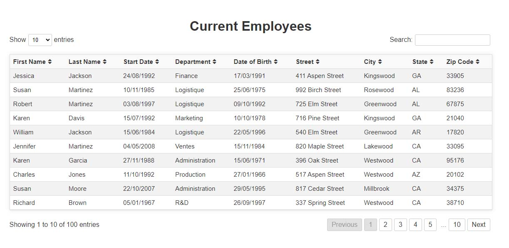

# DataTablePlugin

DataTablePlugin is a custom React component, part of a project on the [OpenClassrooms Front-End learning path](https://openclassrooms.com/fr/paths/516-developpeur-dapplication-javascript-react).
It's designed to display, sort, filter, paginate, and manage tabular data efficiently.



## Prerequisites
- [NodeJS (version 16.17.0)](https://nodejs.org/en/)
- [NPM (version 9.4.0)](https://www.npmjs.com/)
- [React (version 18.2.0)](https://react.dev/)

## Getting started

### Installation
```bash
    npm install @ericbouillautdev/plugin-react-datatable
```
   
### Usage
```jsx
import DataTablePlugin from 'ebo-react-datatable';
import 'ebo-react-datatable/dist/DataTablePlugin.css';

// Define data and columns
const data = [{...}, {...}];
const columns = [{ title: 'First Name', key: 'firstName' }, ...];

function App() {
    return <DataTablePlugin data={data} columns={columns} dateFormat="yyyy-mm-dd" />;
}
```

The DataTablePlugin component takes the following props:

data: An array of objects representing the rows in the table.
columns: An array of objects representing the columns in the table. Each object should have a title (the column header) and a key (the key in the data that this column should display).
dateFormat: A string representing the format of the dates in the table. Default is 'dd/mm/yyyy'.
  available formats:
    'dd/mm/yyyy'
    'mm/dd/yyyy'
    'yyyy/mm/dd'
    'dd-mm-yyyy'
    'mm-dd-yyyy'
    'yyyy-mm-dd'
    'dd.mm.yyyy'
    'mm.dd.yyyy'
    'yyyy.mm.dd'
    ISO --> (yyyy-mm-ddThh:mm:ss)

exemple:

```jsx
const columns = [
  { title: "First Name", data: "firstName" },
  { title: "Last Name", data: "lastName" },
  { title: "Start Date", data: "startDate" },
  { title: "Department", data: "department" },
  { title: "Date of Birth", data: "dateOfBirth" },
  { title: "Street", data: "street" },
  { title: "City", data: "city" },
  { title: "State", data: "state" },
  { title: "Zip Code", data: "zipCode" },
];

const users = [
  {
    firstName: "Patrick",
    lastName: "Ward",
    dateOfBirth: "07/04/1987",
    startDate: "28/12/2022",
    department: "Finance",
    street: "160 Michael Garden",
    city: "Singhberg",
    state: "AZ",
    zipCode: "65578",
  },
];
return <DataTablePlugin data={users} columns={columns} dateFormat="mm/dd/yyyy" />;
```

✨ Features and Interface
The component offers functionalities like sorting, searching and pagination with an intuitive UI.

📝 License
This project is licensed under the MIT License.

👨‍💻 Author
This project was created by [Eric Bouillaut](e.bouillaut@yahoo.fr).
